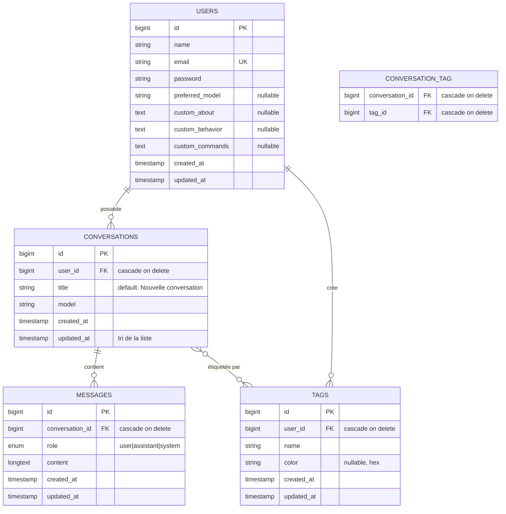
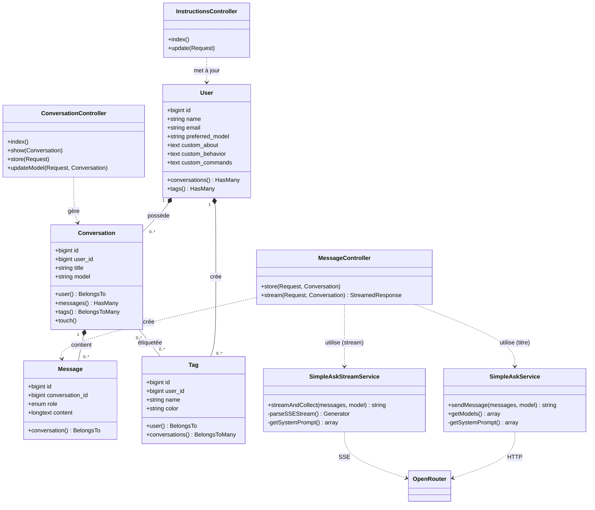

# yoat-companion 🟢

> Le mentor Jedi de la programmation — un clone ChatGPT thématisé, construit autour d'une vraie base de données relationnelle.

**Projet de développement (SGBD) — IDV4**

`yoat-companion` (contraction de *Yoda chat companion*) est un assistant d'apprentissage de la programmation qui adopte la personnalité d'un mentor sage inspiré de Maître Yoda. Il guide l'apprenant vers la solution plutôt que de la lui donner.

---

## ✨ Fonctionnalités

### Obligatoires

- **Sélecteur de modèles** — bascule entre les LLM disponibles via OpenRouter (GPT, Claude, Gemini, Mistral, Grok…)
- **Historique des conversations** — sauvegarde automatique en base, titre généré par le LLM au premier message, tri par activité récente
- **Streaming des réponses** — affichage token par token en temps réel via Server-Sent Events (SSE)
- **Instructions personnalisées** — personnalité de l'IA configurable par utilisateur (à propos, comportement, commandes), injectée dans le prompt système
- **Composition API** — tous les composants en `<script setup lang="ts">`

### Supplémentaires

- **Réglage de la température** — curseur 0–2 pour ajuster la créativité des réponses
- **Tags / dossiers** — organisation des conversations par étiquettes (relation N-N)
- **Rendu Markdown + coloration syntaxique** — essentiel pour un assistant de code
- **Trace de raisonnement** — affichage séparé des tokens de *reasoning* pour les modèles compatibles
- **Mémorisation du modèle préféré** — l'expérience reprend là où l'utilisateur s'était arrêté
- **Thème sombre** par défaut, branding cohérent

---

## 🛠️ Stack technique

| Couche | Technologie |
|--------|-------------|
| Backend | Laravel 13 (PHP 8.4), Eloquent ORM |
| Pont | Inertia.js |
| Frontend | Vue 3 (Composition API), TypeScript |
| UI | TailwindCSS, shadcn-vue |
| Base de données | SQLite (dev) — agnostique, migrable vers MySQL/PostgreSQL |
| LLM | OpenRouter API (accès unifié multi-modèles) |
| Streaming | `@laravel/stream-vue` + `StreamedResponse` |
| Routes typées | Wayfinder |

---

## 🗄️ Modèle de données

### Diagramme entité-relation (ERD)



> La table pivot `conversation_tag` matérialise la relation N-N entre `conversations` et `tags`. Une contrainte d'unicité sur `(conversation_id, tag_id)` empêche d'attacher deux fois le même tag.

### Diagramme de classe (UML)



> **Composition (losange plein)** : l'enfant ne survit pas au parent (`ON DELETE CASCADE`).
> **Dépendance (pointillés)** : le contrôleur utilise un service injecté par le conteneur Laravel.

---

## 📐 Tables & règles métier

### `users`
Table Fortify étendue de quatre colonnes métier : `preferred_model` (dernier LLM choisi, proposé par défaut) et `custom_about` / `custom_behavior` / `custom_commands` (instructions personnalisées injectées dans le prompt système).

### `conversations`
Un fil de discussion. `title` est généré automatiquement par le LLM après le premier échange. `model` fige le LLM de la conversation. `updated_at` est mis à jour par `touch()` après chaque message pour le tri.

### `messages`
Un message par ligne. `role` est un `enum('user','assistant','system')` (contrainte au niveau du SGBD). `content` est en `longText` (les réponses LLM dépassent souvent 64 Ko). L'ordre chronologique (`ORDER BY id`) constitue le *context window* envoyé au modèle.

### `tags` + `conversation_tag`
Relation **N-N** : une conversation peut porter plusieurs tags, un tag peut étiqueter plusieurs conversations. Les tags appartiennent à un utilisateur (`user_id`). La table pivot relie les deux avec cascade des deux côtés.

### Contraintes garanties
- Un message appartient toujours à exactement une conversation ; une conversation à exactement un utilisateur.
- `ON DELETE CASCADE` sur toutes les clés étrangères : supprimer un utilisateur efface ses conversations, messages et tags (conformité RGPD en une instruction).
- Le rôle d'un message est contraint par un `enum` au niveau du schéma.
- Le message utilisateur est persisté **avant** l'appel API : aucune perte si le streaming échoue.
- Chaque requête API est plafonnée à `max_tokens: 1024`.
- Vérification de propriété (`abort_unless … 403`) sur chaque route paramétrée — protection contre les failles IDOR.

> Le schéma est en **troisième forme normale (3NF)**. La présence de `model` dans `users` (préférence) et `conversations` (état figé) n'est pas une redondance mais deux sémantiques distinctes.

---

## 🔄 Cycle d'une requête de streaming

```
1. Vue : useStream.send({content, temperature})  →  POST /chat/{id}/stream
2. MessageController::stream() : abort_unless (403) + validation
3. INSERT message utilisateur (persisté avant l'appel API)
4. SELECT de tous les messages = context window (ORDER BY id)
5. SimpleAskStreamService::streamAndCollect() :
   chaque chunk SSE reçu d'OpenRouter → echo + flush (client) + accumulation
6. Fin du flux : INSERT message assistant (texte complet accumulé)
7. Premier échange ? → 2e appel API pour générer le titre → UPDATE
8. touch() → updated_at → la conversation remonte en tête de liste
9. Vue onFinish : router.reload (partiel) → resynchronisation depuis la base
```

Le streaming contourne volontairement Inertia (qui attend une réponse JSON complète) via un `fetch` direct, puis Inertia reprend la main avec un *partial reload* — la base reste la source de vérité.

---

## 🚀 Installation

```bash
# Cloner et installer les dépendances
git clone https://github.com/buhovac/CloneGPT.git
cd CloneGPT
composer install
npm install

# Configuration
cp .env.example .env
php artisan key:generate

# Ajouter la clé OpenRouter dans .env :
# OPENROUTER_API_KEY=sk-or-v1-...

# Base de données
php artisan migrate

# Générer les routes typées
php artisan wayfinder:generate

# Lancer (dev)
composer dev   # ou : php artisan serve + npm run dev
```

L'application utilise [Laravel Herd](https://herd.laravel.com/) en développement, accessible sur `https://yoat-companion.test`.

---

## ⚙️ Configuration requise

- PHP 8.4+
- Node.js 20+
- Une clé API [OpenRouter](https://openrouter.ai) (le tier gratuit suffit, d'où `max_tokens: 1024`)

---

## 📁 Structure du projet

```
app/
├── Http/Controllers/
│   ├── ConversationController.php   # liste, affichage, création, choix du modèle
│   ├── MessageController.php        # envoi de messages + streaming SSE
│   └── InstructionsController.php   # instructions personnalisées
├── Models/
│   ├── User.php                     # + conversations(), tags()
│   ├── Conversation.php             # + messages(), tags(), user()
│   ├── Message.php                  # + conversation()
│   └── Tag.php                      # + conversations(), user()
└── Services/
    ├── SimpleAskService.php         # appels synchrones (titre)
    └── SimpleAskStreamService.php   # streaming SSE + parsing

resources/
├── js/Pages/
│   ├── Chat/Index.vue               # interface principale (streaming intégré)
│   ├── Instructions/Index.vue       # configuration des instructions
│   └── AskStream/Index.vue          # démo streaming autonome
└── views/prompts/
    └── system.blade.php             # prompt système thématisé + instructions
```

---

## 🎓 Contexte

Projet réalisé dans le cadre du cours *Projet de développement (SGBD) — IDV4*. L'accent de l'évaluation porte sur la qualité du schéma de base de données, l'intégrité référentielle et les fonctionnalités qui sollicitent la base.

Assistance IA (Claude) utilisée pour la génération de squelettes de code, le débogage et la rédaction, conformément à la politique du cours — sans agent de programmation autonome. Détails dans le cahier métacognitif.
